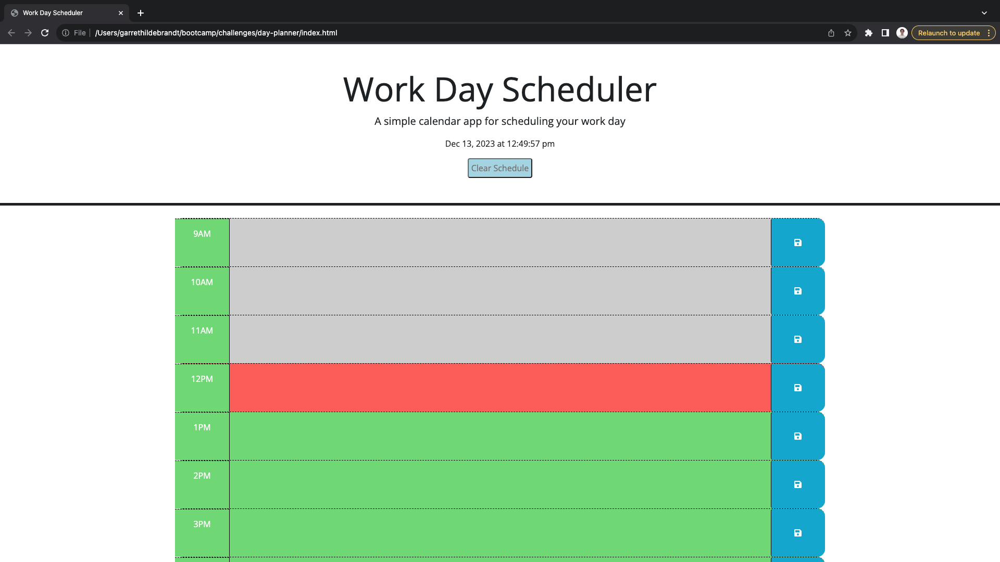
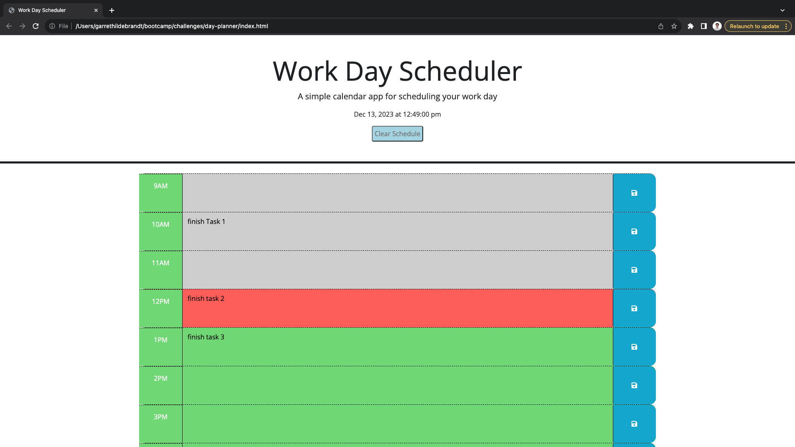
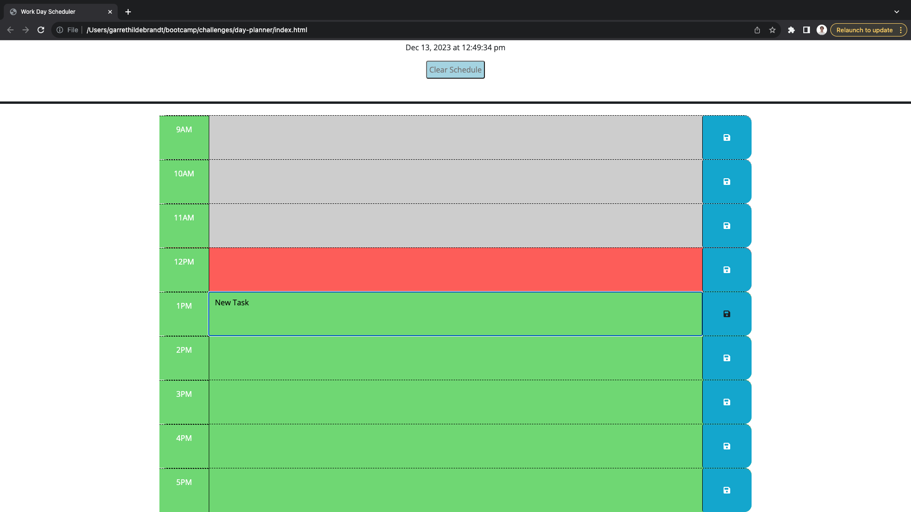

# Day-Planner

## Description

The Day-Planner is meant to allow you to add tasks for each hour of your work day to help stay organized. The styling is responsive to the time of day where past, present and future hours are all indicated by background colour. 

## Installation

N/A

## Usage

To add a task to the planner click on the block you would like to add to and start typing. Click the blue save button for that hour to save that task to the planner. All grey blocks are hours that have passed, red is for the current hour and green shows the future hours. If you would like to clear the day planner completely you can click the "clear Schedule" button in the header. or if you would like to modify a single task you can click into the text block, make your changes and save them like a new task. 

[Deployed Day-planner page](https://garrethil.github.io/day-planner/)

## Credits

N/A

## License

Refer to the LICENSE in repo.
